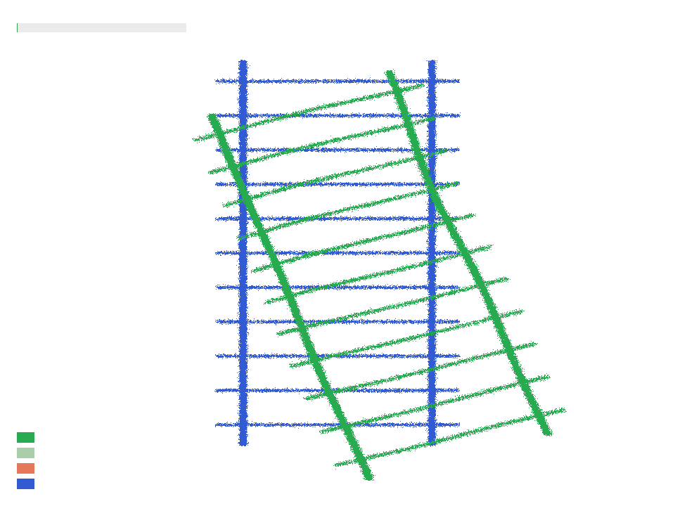
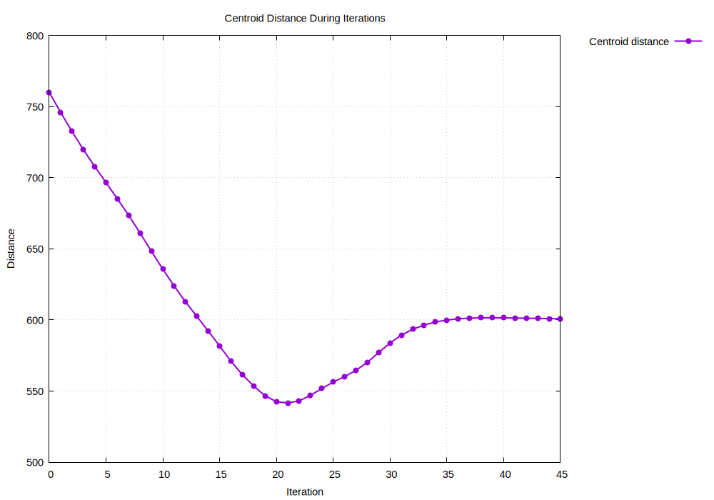
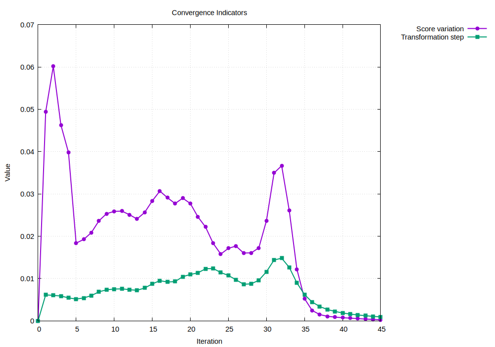
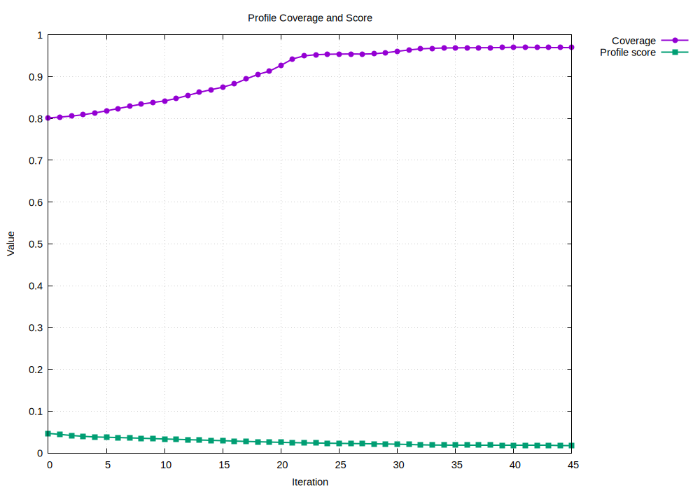
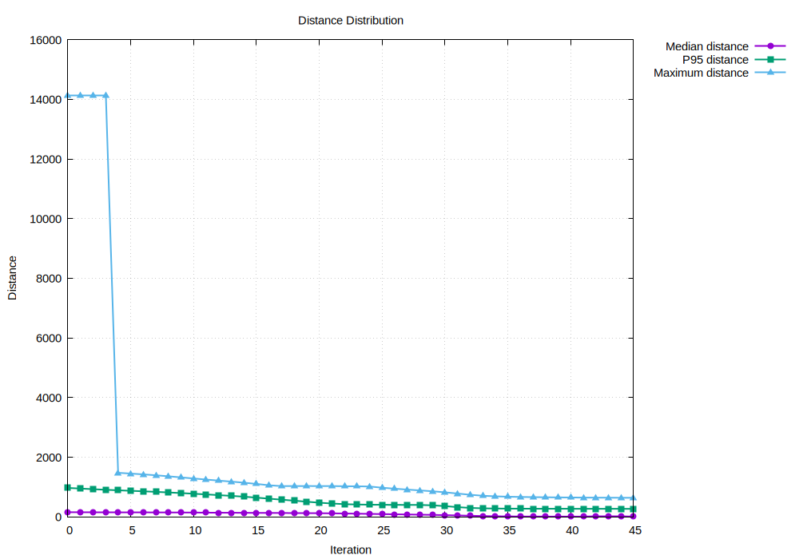
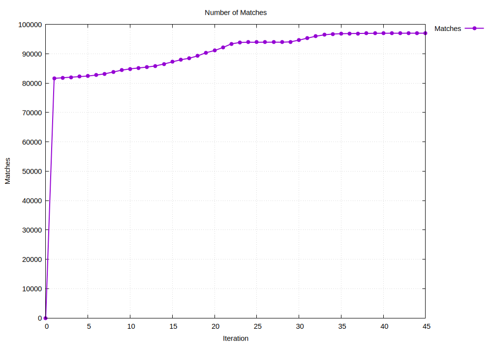
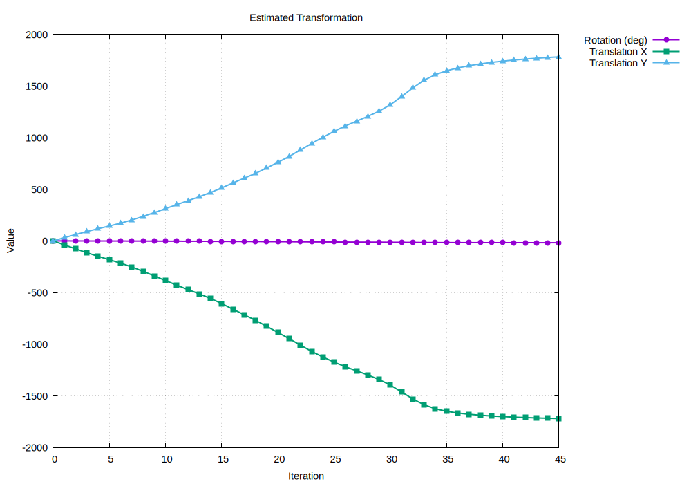
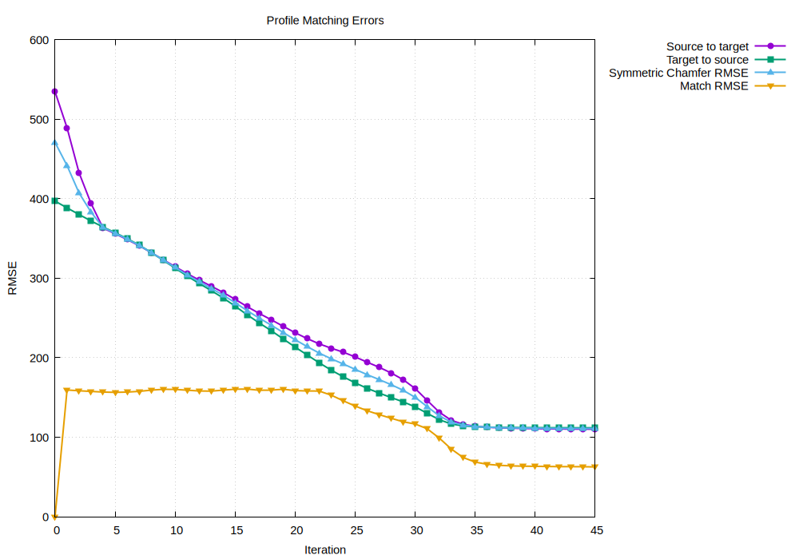

# Point Cloud Collimation

# Ejercicio A 

### Estructura y Funciones Principales del Código

- **Generación del perfil objetivo (H / Riel):**
  Esta función genera de una nube de puntos que semeja una vía de tren, de forma de H. Utiliza una semilla pseudoaleatoria fija y distribuye los puntos alternando de forma cíclica entre el riel izquierdo, el riel derecho y la estructura de los durmientes. A cada coordenada se le aplica un ruido y un límite para simular la dispersión real de los datos.

- **Deformación aleatoria del perfil fuente:**
  Esta función aplica una deformación no rígida a la nube de puntos. Se agregan deformaciones o **bumps** de una forma aleatoria. Cada **bump** es un elemento dentro de un vector que los almacena, cada uno de ellos presenta variaciones que agrega dispersión al conjunto.

- **Construcción de la estructura `GridIndex`:**
  Esta clase implementa una grilla para acelerar la búsqueda de puntos vecinos respecto a una búsqueda exhaustiva. Divide el espacio 2D en celdas cuadradas según un tamaño definido (*cell_size*), indexa las coordenadas en un mapa mediante una clave de 64 bits y agrupa los puntos en sus celdas correspondientes. Durante las consultas, la estructura busca hacia afuera desde la celda de origen, restringiendo las comprobaciones de distancia euclidiana únicamente a los puntos de las celdas cercanas.

- **Búsqueda de vecinos más cercanos:**
  Esta función calcula la distancia euclidiana al vecino más cercano para cada punto de una nube utilizando la grilla `GridIndex`. Recorre uno a uno los puntos, consulta la estructura utilizando comparaciones de distancias al cuadrado y convierte el resultado final con una raíz cuadrada. En caso de que un punto no encuentre ningún vecino en el índice, la función le asigna un valor por defecto (*missing_distance*), entregando como resultado un vector de distancias por punto ideal para evaluar la superposición o error de alineación entre dos nubes.

- **Estimación de la transformación rígida:**
  Esta función calcula la rotación y traslación en 2D para alinear una nube fuente con una objetivo a partir de un conjunto de correspondencias directas. Para lograrlo, calcula primero los centroides de ambos conjuntos y los resta para centrar los datos en el origen, eliminado el efecto del desplazamiento global. Luego, acumula los productos escalares de las coordenadas centradas para obtener el ángulo de rotación exacto mediante `atan2`, y finalmente calcula el vector de traslación necesario para posicionar la nube transformada sobre el centroide objetivo.

- **Comparación de perfiles (Centroides y Distancias):**
  Esta función evalúa la calidad de la alineación entre dos nubes de puntos mediante métricas geométricas bidireccionales y simétricas. Construye grillas espaciales para ambas nubes, calcula la distancia de cada punto fuente hacia su vecino objetivo más cercano y viceversa, y determina la distancia entre sus centroides globales. Además, fusiona todas las distancias obtenidas para extraer la mediana, el percentil 95, el valor máximo, el error cuadrático medio simétrico (RMSE) y un porcentaje de cobertura de puntos que se encuentran dentro de un umbral de tolerancia.

- **Renderizado de cuadros (Visor):**
  Esta función convierte una secuencia de fotogramas de la trayectoria en una animación de video en tiempo real utilizando el pipeline de GStreamer. Inicializa un flujo de video raw RGB a 960x720 píxeles y 5 FPS, dibuja mediante una función auxiliar los perfiles objetivo, fuente y las iteraciones intermedias, y envía cada búfer de imagen a la canalización multimedia. Maneja la sincronización de tiempos frame a frame y libera de manera limpia los recursos del sistema al concluir la reproducción de la trayectoria.

---

### Instrucciones de Ejecución y Exportación

El programa se ejecuta corriendo los siguientes comandos:

```bash
make clean 
make 
./point_cloud_collimation --export
```

Esto genera múltiples archivos csv y también los frames individuales de extensión ppm.

### Resultados obtenidos

A partir de los fotogramas generados, es posible visualizar la evolución de ambas nubes de puntos y el proceso de iteración mediante el cual la nube origen se transforma y alinea con la nube objetivo:

<p align="center">
  
  <br>
  <em>Figura 1: Animación de la alineación y colimación de la nube de puntos.</em>
</p>

---

#### Análisis de Métricas y Gráficos de Convergencia

A partir de los datos exportados en los archivos CSV, se generaron las siguientes gráficas que caracterizan el comportamiento del algoritmo:

| Métrica de Error y Distancia | Análisis de Convergencia y Cobertura |
| :---: | :---: |
|  |  |
| **Distancia de centroides** a lo largo de las iteraciones | **Criterio y velocidad de convergencia** |
|  |  |
| **Puntuación de cobertura** del perfil | **Distribución de distancias** entre puntos |

| Correspondencia y RMSE | Transformación Aplicada |
| :---: | :---: |
|  |  |
| **Emparejamiento de puntos (*matches*)** entre perfiles | **Evolución del paso de transformación** |

<p align="center">
  
  <br>
  <em>Figura 2: Evolución de las métricas de error cuadrático medio (RMSE).</em>
</p>


Finalmente, los centroides representan la posición promedio de todos los puntos de un perfil. En las primeras iteraciones, la distancia entre el centroide del perfil fuente (*source*) y el del objetivo (*target*) suele ser grande debido a la desalineación inicial; a medida que el algoritmo avanza, esta distancia disminuye progresivamente hasta estabilizarse; sin embargo, conforme se realizan las ultimas iteraciones se puede observar que esta distancia incremente. Mediante análisis visual de la animación presentada anteriormente, se puede observar que cuando se alinean las nubes de puntos no quedan superpuestas perfectamente, sino que presentan una desalineación. De aquí se puede comprender que por este desfase la distancia entre centroides final no resulta ser la ideal.

Las métricas de error evalúan la alineación mediante distintas perspectivas: `match_rmse` mide el error cuadrático medio considerando únicamente las parejas de puntos asociados entre ambos perfiles, `symmetric_chamfer_rmse` calcula el error de la fuente al objetivo y viceversa y `profile_score` es una métrica general que combina la precisión de las distancias con la tasa de cobertura de puntos alineados bajo un umbral de tolerancia.

Una deformación no rígida introduce distorsiones que alteran la forma interna del perfil. Dado que la transformación recuperada por el algoritmo está restringida a solo rotaciones y traslaciones, este no puede modelar los cambios locales, lo que impide que la transformación estimada coincida exactamente con la transformación ideal utilizada antes de deformar el objeto. Es decir que esta deformación hace que las dos nubes de puntos sean distintas, pero aún así el programa busca hacer que se alineen con bajo error.


# Ejercicio B

## Profiling con perf

### perf stat

Primero se utilizó `perf stat` para obtener estadísticas globales de la ejecución.

En la computadora utilizada, `perf_event_paranoid` tenía el valor 4. Esta configuración restringía el acceso a los contadores de hardware utilizados por `perf`, por lo que fue necesario ejecutar las mediciones con `sudo`.

Sin exportación:

```bash
sudo perf stat -e cycles,instructions,branches,branch-misses,cache-references,cache-misses ./point_cloud_collimation
```

Con exportación:

```bash
sudo perf stat -e cycles,instructions,branches,branch-misses,cache-references,cache-misses ./point_cloud_collimation --export
```

Los principales resultados fueron:

| Métrica | Sin `--export` | Con `--export` |
|---|---:|---:|
| Tiempo | 90.799 s | 105.118 s |
| Ciclos | 245,189,235,945 | 281,455,201,968 |
| Instrucciones | 206,752,172,429 | 239,079,272,994 |
| Branches | 27,446,425,765 | 33,774,596,421 |
| Branch misses | 688,580,519 | 749,063,863 |
| Cache references | 33,041,980,015 | 33,157,376,901 |
| Cache misses | 3,819,486,864 | 4,403,591,431 |

La ejecución con `--export` tardó aproximadamente 14.32 segundos más.

Los valores principales de estas pruebas se dejaron resumidos en:

```text
results-EjercicioB/perf_stat_results.txt
```

### Localización de hotspots con perf record

Después de obtener las estadísticas globales se utilizó `perf record` para tomar muestras durante la ejecución y `perf report` para observar en qué funciones se concentraban.

Sin exportación:

```bash
sudo perf record -g ./point_cloud_collimation
```

Este comando genera el archivo:

```text
perf.data
```

Para obtener un reporte más sencillo de revisar se utilizó:

```bash
sudo perf report -i perf.data --stdio --no-children --call-graph=none > perf_summary_no_export.txt
```

Para la ejecución con exportación se utilizó un nombre diferente para no sobrescribir el perfil anterior:

```bash
sudo perf record -g -o perf_export.data ./point_cloud_collimation --export
```

El resumen correspondiente se obtuvo con:

```bash
sudo perf report -i perf_export.data --stdio --no-children --call-graph=none > perf_summary_export.txt
```

El principal hotspot identificado fue `GridIndex::nearest()`.

Sin `--export`, esta función representó aproximadamente un 97.14 % del `self overhead`.

Con `--export`, continuó siendo la función dominante, con aproximadamente un 88.67 %.

## Profiling con Valgrind / Callgrind

También se utilizó Callgrind para analizar el programa desde otra perspectiva, contando principalmente referencias de instrucciones.

Sin exportación:

```bash
valgrind --tool=callgrind --callgrind-out-file=callgrind_no_export.out ./point_cloud_collimation
```

El reporte se convirtió a un archivo de texto mediante:

```bash
callgrind_annotate callgrind_no_export.out > callgrind_report_no_export.txt
```

Con exportación:

```bash
valgrind --tool=callgrind --callgrind-out-file=callgrind_export.out ./point_cloud_collimation --export
```

El reporte correspondiente se obtuvo con:

```bash
callgrind_annotate callgrind_export.out > callgrind_report_export.txt
```

Los resultados principales fueron:

| Configuración | Ir total | `GridIndex::nearest()` |
|---|---:|---:|
| Sin `--export` | 205,733,271,542 | 81.01 % |
| Con `--export` | 237,412,442,596 | 70.20 % |

## Profiling con Google Performance Tools

Para esta parte fue necesario realizar algunos ajustes debido a las herramientas disponibles en la computadora.

El comando `google-pprof` no estaba disponible directamente en el sistema. Por esta razón se utilizó `libprofiler` de Google Performance Tools para generar los perfiles y la versión actual de `pprof` para analizarlos.

Para permitir el profiling se recompiló temporalmente el programa enlazando `libprofiler` y conservando el frame pointer:

```bash
make clean
make CXXFLAGS="-std=c++17 -O2 -g -Wall -Wextra -pedantic -fno-omit-frame-pointer" GST_LIBS="-Wl,--no-as-needed -lprofiler -Wl,--as-needed $(pkg-config --libs gstreamer-1.0 gstreamer-app-1.0)"
```

Se verificó que `libprofiler` estuviera enlazada con el ejecutable mediante:

```bash
ldd ./point_cloud_collimation | grep profiler
```

Sin exportación se generó el perfil con:

```bash
CPUPROFILE=point_cloud.prof ./point_cloud_collimation
```

y se analizó con:

```bash
~/go/bin/pprof -text ./point_cloud_collimation point_cloud.prof > pprof_report_no_export.txt
```

Para la ejecución con exportación:

```bash
CPUPROFILE=point_cloud_export.prof ./point_cloud_collimation --export
```

El reporte se generó con:

```bash
~/go/bin/pprof -text ./point_cloud_collimation point_cloud_export.prof > pprof_report_export.txt
```

Los resultados principales fueron:

| Configuración | `nearest()` flat | `nearest()` cumulative |
|---|---:|---:|
| Sin `--export` | 64.23 % | 98.24 % |
| Con `--export` | 56.97 % | 87.97 % |

## Archivos de resultados

Los reportes utilizados para documentar el ejercicio se encuentran en:

```text
results-EjercicioB/
├── callgrind_report_export.txt
├── callgrind_report_no_export.txt
├── perf_stat_results.txt
├── perf_summary_export.txt
├── perf_summary_no_export.txt
├── pprof_report_export.txt
└── pprof_report_no_export.txt
```

Los perfiles crudos, como `perf.data`, `perf_export.data` y los archivos `.prof`, se utilizaron durante el análisis, pero no se incluyeron como resultados finales del repositorio.

## Respuestas del Ejercicio B

### ¿Cuáles fueron los hotspots encontrados con cada herramienta?

Las tres herramientas mostraron que la mayor parte del costo del programa está relacionada con `GridIndex::nearest()`, que es la función encargada de buscar los vecinos más cercanos.

Con `perf report`, esta función presentó aproximadamente un 97.14 % de `self overhead` sin `--export` y un 88.67 % con `--export`.

Con Callgrind, `GridIndex::nearest()` representó aproximadamente un 81.01 % de las referencias de instrucciones sin exportación y un 70.20 % con exportación.

Por último, con `pprof` se obtuvo un 64.23 % `flat` y un 98.24 % `cumulative` sin `--export`. Con exportación los valores fueron 56.97 % `flat` y 87.97 % `cumulative`.

### ¿Coinciden perf, Google Performance Tools y Valgrind?

Sí. Los valores obtenidos no son iguales porque cada herramienta mide el programa de una forma diferente, pero las tres identificaron `GridIndex::nearest()` como la región dominante.

### ¿Cuál es el costo de utilizar `--export`?

Según `perf stat`, el tiempo pasó de aproximadamente 90.80 s sin exportación a 105.12 s con exportación.

Esto representa un aumento cercano al 15.77 %. Con `--export` al parecer se realiza trabajo adicional.


# Ejercicio D

## Regiones instrumentadas con std::chrono

Se crearon las siguientes regiones:

- `target_generation`: genera el perfil objetivo (riel en H).
- `source_transform_deform_noise`: transforma, deforma y agrega ruido al perfil fuente.
- `grid_index_construction`: construye el `GridIndex`.
- `nearest_neighbor_search`: búsqueda de vecinos más cercanos en cada iteración del ICP.
- `estimate_transform`: estima la transformación rígida.
- `profile_metrics`: calcula las métricas de comparación entre perfiles.
- `export_csv_ppm`: exporta los CSV y los cuadros PPM.
- `viewer_render_send`: renderiza y envía los cuadros al visor de GStreamer.

## Cómo correr la instrumentación

Se agregó un parámetro `--profile-repeats N` al `main` para poder correr el programa varias veces automáticamente y sacar el promedio de cada región.

Solo lo referente al Ejercicio D (sin exportar ni visor):

```bash
./point_cloud_collimation --profile-repeats 5
```

Corrida completa (instrumentación + exportación + visor):

```bash
./point_cloud_collimation --profile-repeats 5 --export --viewer
```

Este es el log que imprimió el programa y que se usó para armar la tabla de abajo:

```text
=== Resumen de instrumentacion (promedios) === con N=5
region                           samples        avg_ms        total_ms
estimate_transform                   225        0.5154        115.9657
export_csv_ppm                        30      127.9592       3838.7769
grid_index_construction              235        4.9888       1172.3616
nearest_neighbor_search              225      225.3077      50694.2247
profile_metrics                      230      451.7698     103907.0452
source_transform_deform_noise          5       23.8520        119.2599
target_generation                      5        7.9395         39.6975
viewer_render_send                    29       20.1771        585.1350

Instrumentation CSV written to "instrumentation.csv"
```

`samples` es el número de veces que el programa entró a esa región (por ejemplo, `nearest_neighbor_search` entra 225 veces porque son ~45 iteraciones del ICP × 5 repeticiones).

## Comparación por región: Ejercicio D vs. Ejercicio B

La siguiente tabla sirve para saber qué región de la instrumentación (Ejercicio D) corresponde a qué función del código (Ejercicio B), y compara cuánto duraba cada una en un ejercicio y en el otro.

**Aclaración:** las diferencias que se ven no son solo por variación entre corridas sino también que el Ejercicio B se corrió en la computadora de Fiorela y el Ejercicio D en la de Fabián. Por eso conviene fijarse en los **porcentajes** más que en los segundos absolutos: así se puede analizar si una región ocupa la misma proporción del tiempo total del programa en ambos casos, sin que el hardware distinto distorsione la comparación.

| Región (Ejercicio D) | D: % del tiempo | D: seg. por corrida | Función(es) en B | B: seg. (sin export / con export) | B: % |
|---|---:|---:|---|---:|---:|
| profile_metrics | 64.75% | 20.78 s | `compare_profiles` — coincide: construye grids + busca vecinos en ambas direcciones + calcula centroides/RMSE | 42.15 s / 40.46 s | 66.16% / 59.79% |
| nearest_neighbor_search | 31.59% | 10.14 s | `collimate_icp` menos `compare_profiles` (el resto del bucle: la búsqueda directa de vecinos + `estimate_rigid_transform` + bookkeeping) | 21.50 s / 20.17 s | 33.75% / 29.81% |
| export_csv_ppm | 2.39% | 3.84 s (1 corrida con `--export`) | `export_reconstruction` (incluye `write_cloud_csv` + escritura de PPM) | 6.78 s (solo con `--export`) | 10.02% |
| grid_index_construction | 0.73% | 0.234 s | `GridIndex::GridIndex` (constructor) | 0.42 s / ~0.44 s* | 0.66% / 0.42%* |
| viewer_render_send | 0.36% | 0.585 s (1 corrida con `--export`) | `render_motion_frame` | 0.50 s (solo con `--export`) | 0.74% |
| source_transform_deform_noise | 0.07% | 0.024 s | `add_random_deformation` + `apply_transform` | no aparece en pprof (muy chica); perf ve `apply_transform` ≈0.05s* | ~0.06%* |
| estimate_transform | 0.07% | 0.023 s | `estimate_rigid_transform` | no aparece (por debajo del umbral que pprof reporta) | — |
| target_generation | 0.02% | 0.008 s | `generate_h_rail_cloud` | no aparece (demasiado rápida para el muestreo) | — |

\* pprof no la capturó en la corrida con `--export` (cae bajo su umbral de "nodos insignificantes"), así que se usó el % de `perf report` multiplicado por el tiempo total de esa corrida (`perf stat`) como estimación.

## ¿La región con mayor tiempo coincide con el hotspot de perf, Google Performance Tools y Valgrind?

En base a la tabla anterior se puede ver cómo la región con mayor tiempo es `profile_metrics`, que traducida a función sería `compare_profiles`, pues ambas hacen lo mismo: construyen los grids, buscan vecinos en ambas direcciones y calculan centroides/RMSE.

Calculado en términos de porcentaje (pues el Ejercicio B se corrió en la computadora de Fiorela y el Ejercicio D en la de Fabián) se ve que coinciden en gran manera:

- Región `profile_metrics`: **64.75%**
- Función `compare_profiles`: **66.16%** (sin export) / **59.79%** (con export)

Esto es porque `profile_metrics` busca vecinos más cercanos dos veces (fuente→objetivo y objetivo→fuente), mientras que `nearest_neighbor_search` lo hace una sola vez por iteración del ICP. Como las dos regiones hacen básicamente el mismo trabajo de fondo, tiene sentido que `profile_metrics` tarde alrededor del doble: 451.77 ms vs. 225.31 ms de promedio, casi exactamente 2x.

## ¿Cuánto overhead introduce su instrumentación?

Para calcular el overhead que introduce la instrumentación se corrió el código original 5 veces y el código instrumentado otras 5 veces nuevas, para sacar un promedio igual en ambos casos y evitar variación por condiciones distintas (el primer set de resultados con el que se comparó se había calculado días antes). Esto se hizo con el siguiente comando:

```bash
cd ../point-cloud-collimation-original && \
make clean && make && \
perf stat -r 5 ./point_cloud_collimation > /dev/null 2> ../point-cloud-collimation-forExerciseD/results-EjercicioD/overhead/perf_stat_original.txt && \
cd ../point-cloud-collimation-forExerciseD && \
make clean && make && \
perf stat -r 5 ./point_cloud_collimation > /dev/null 2> results-EjercicioD/overhead/perf_stat_instrumentado.txt && \
echo "LISTO"
```

Se evidenció lo siguiente:

| | Promedio (5 corridas) | Desv. estándar |
|---|---:|---:|
| Original | 25.756 s | ± 0.220 s (±0.85%) |
| Instrumentado | 26.591 s | ± 0.361 s (±1.36%) |
| Diferencia | **+835 ms (+3.24%)** | |

Esto da como conclusión que la instrumentación sí introduce cierto overhead frente a no tenerlo; sin embargo, es un 3.24% del tiempo total, lo que lo hace no tan penalizado en cuanto a tiempo, y definitivamente vale la pena para poder tener un control más preciso de los tiempos de cada parte del software.

## ¿Qué partes del programa son más fáciles de entender con instrumentación manual que con muestreo?

En general parece aplicar a casi todas las regiones, porque la instrumentación da una atención más personalizada a lo que uno quiere medir, con una etiqueta con significado, mientras que el muestreo solo dice en qué función estaba el programa, sin el porqué. Por ejemplo, nearest_neighbor_search y profile_metrics comparten por dentro la misma función (GridIndex::nearest), así que el muestreo las mezcla en un solo número, mientras que la instrumentación deja claro que profile_metrics pesa el doble por buscar en ambas direcciones. Con la exportación de CSV y PPM pasa algo similar: el muestreo reparte ese costo entre funciones internas de la librería estándar que nadie reconocería como "la exportación", pero en la instrumentación es una sola línea clara. Y regiones rápidas, como generar el perfil objetivo, ni aparecen en el muestreo por ser muy breves, mientras que el cronómetro sí les da un número exacto.

## ¿Qué información no puede obtener con instrumentación manual?

La instrumentación manual solo dice cuánto tarda el bloque medido, no el por qué. Por ejemplo, marcaba que nearest_neighbor_search era lento, pero no que el tiempo se iba en la tabla hash interna y no en comparar coordenadas, eso lo reveló el muestreo del Ejercicio B precisamente. Tampoco distinguía si la lentitud era por cómputo o por espera de memoria pues eso lo mostró perf stat con cache-misses y branch-misses, algo que std::chrono no puede ver. Es por eso que la instrumentación nunca lo habría mostrado, mientras que el perfilado del Ejercicio B lo encontró sin adivinar dónde mirar.

### ¿Qué herramienta fue más clara para decidir qué optimizar?

Puede decirse que, `perf report` fue la herramienta más clara para identificar qué parte del programa convendría estudiar primero para una optimización, porque mostró directamente que `GridIndex::nearest()` concentraba aproximadamente un 97.14 % del `self overhead` sin exportación.

# Ejercicio E

Así se pueden correr ambos generando un txt con los resultados además del log:

```bash
cd /home/fabian/Documentos/Lab-Optimizacion/point-cloud-collimation-original
perf stat ./point_cloud_collimation > /dev/null 2> /home/fabian/Documentos/Lab-Optimizacion/point-cloud-collimation-exerciseE/logs/perf_stat_original.txt

cd /home/fabian/Documentos/Lab-Optimizacion/point-cloud-collimation-exerciseE
perf stat ./point_cloud_collimation_optimized > /dev/null 2> logs/perf_stat_optimizado.txt
```

## Hipótesis de lo que se cambiará

En el Ejercicio D se vio que casi todo el tiempo del programa se iba en dos partes que en el fondo hacen lo mismo: buscar el punto más cercano dentro de una cuadrícula (`GridIndex::nearest`). Una de ellas, `profile_metrics`, se llevaba sola casi dos tercios del tiempo total porque hace esa búsqueda para los 100,000 puntos de la nube, dos veces (fuente→objetivo y objetivo→fuente), en cada iteración del ICP.

La hipótesis es que si se reduce cuántas veces se llama a esa búsqueda, o qué tan cara es cada llamada, el tiempo total debería bajar en proporción, sin perder precisión en el resultado final (la posición estimada del riel). Se plantean dos cambios, cada uno con una razón técnica propia además de "es lo que más tarda":

1. **Menos búsquedas** en `profile_metrics`: esta función solo puntúa qué tan bien va la colimación en cada iteración, no calcula la transformación en sí, así que no necesita revisar la nube completa para dar un número confiable.
2. **Búsquedas más baratas** en el ICP: la búsqueda de vecino siempre exploraba hasta 16 anillos de celdas para garantizar el vecino global más cercano, pero el ICP descarta cualquier punto más lejano que `match_threshold`, así que explorar tantos anillos es trabajo de más.

## ¿Qué se optimizó y cómo cambió en el código?

### Optimización 1 — muestreo en `profile_metrics`

**Antes:**

```cpp
static ProfileMetrics compare_profiles(const std::vector<Point> &target,
                                       const std::vector<Point> &source,
                                       double coverage_threshold,
                                       double missing_distance) {
  ...
  std::vector<double> source_distances =
      nearest_neighbor_distances(target_index, source, missing_distance);
  std::vector<double> target_distances =
      nearest_neighbor_distances(source_index, target, missing_distance);
```

**Después:**

```cpp
static ProfileMetrics compare_profiles(const std::vector<Point> &target,
                                       const std::vector<Point> &source,
                                       double coverage_threshold,
                                       double missing_distance,
                                       std::size_t sample_stride) {
  ...
  const std::vector<Point> source_sample = sample_cloud(source, sample_stride);
  const std::vector<Point> target_sample = sample_cloud(target, sample_stride);

  std::vector<double> source_distances =
      nearest_neighbor_distances(target_index, source_sample, missing_distance);
  std::vector<double> target_distances =
      nearest_neighbor_distances(source_index, target_sample, missing_distance);
```

(+ nueva función `sample_cloud`, y las 2 llamadas a `compare_profiles` en `collimate_icp` ahora pasan `kProfileMetricsSampleStride = 5`.)

`sample_cloud` toma 1 de cada 5 puntos de la nube (la nube ya viene desordenada desde antes, así que agarrar cada quinto punto equivale a una muestra al azar). `compare_profiles` usa esa muestra, en vez de la nube completa, para calcular el RMSE, los percentiles y la cobertura. Los centroides se siguen calculando con todos los puntos porque son baratos (no necesitan buscar vecinos). El resultado es el mismo tipo de métrica, con 5 veces menos búsquedas.

### Optimización 2 — radio de búsqueda acotado en el ICP

**Antes:**

```cpp
bool nearest(const Point &query, Point &nearest_point,
             double &nearest_distance2) const {
  ...
  for (int radius = 0; radius <= 16; ++radius) {
```

```cpp
if (index.nearest(p, nearest_point, d2) &&
    d2 < match_threshold * match_threshold) {
```

**Después:**

```cpp
bool nearest(const Point &query, Point &nearest_point,
             double &nearest_distance2, int max_radius = 16) const {
  ...
  for (int radius = 0; radius <= max_radius; ++radius) {
```

```cpp
if (index.nearest(p, nearest_point, d2, kMatchSearchMaxRadius) &&
    d2 < match_threshold * match_threshold) {
```

(+ nueva constante `kMatchSearchMaxRadius = ceil(420/90)+1 = 6`.)

Se agregó un límite (`max_radius`) a cuántos anillos de celdas explora la búsqueda de vecino más cercano. En el ICP, como solo importan los puntos a menos de `match_threshold = 420` unidades y cada celda mide 90, con 6 anillos ya alcanza para cubrir esa distancia — cualquier punto más lejos se iba a descartar de todas formas. Antes se exploraban hasta 16 anillos siempre, sin importar el umbral. El resultado es que cada búsqueda de vecino en el ICP recorre menos celdas.

## Resultados

- `logs/perf_stat_original.txt` → 26.307 s
- `logs/perf_stat_optimizado.txt` → 11.321 s

Esto hace al código alrededor de 2.3x más rápido con solo los dos cambios planteados.

Callgrind y `pprof` fueron útiles para confirmar este resultado utilizando otras formas de medición.
